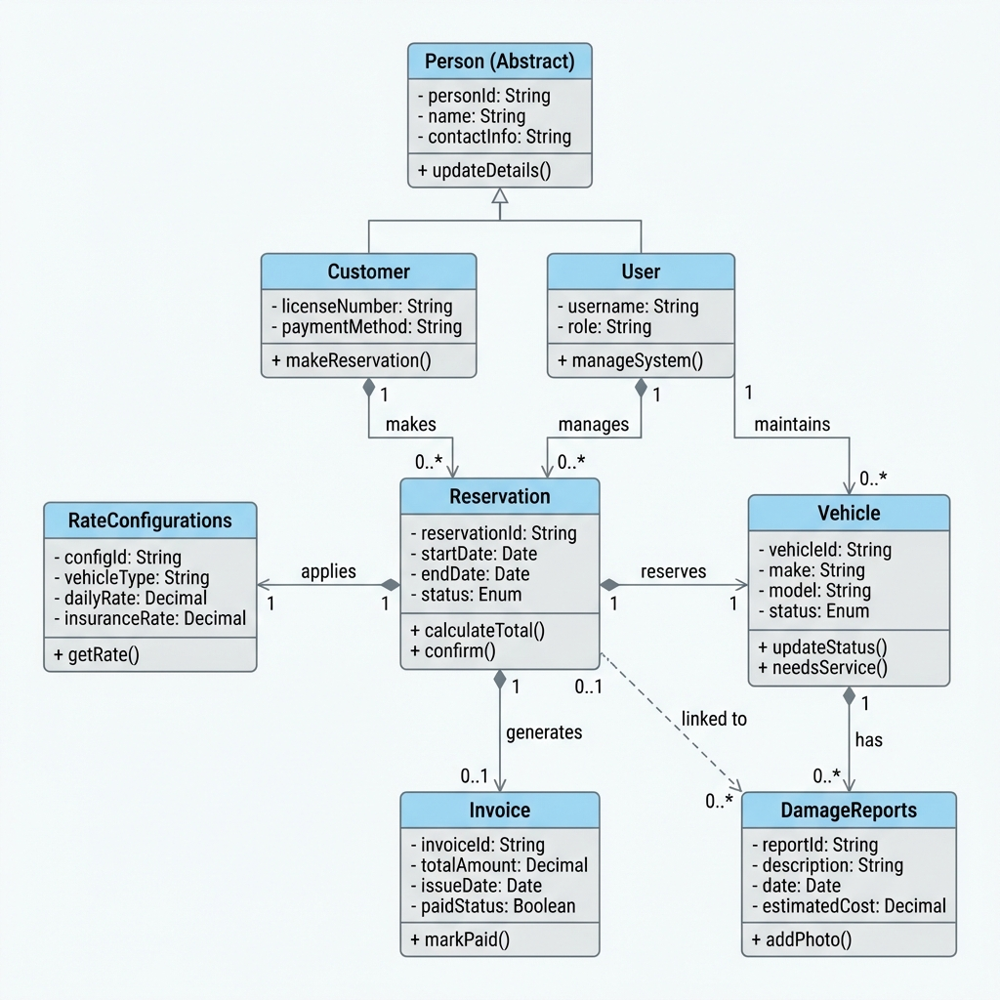
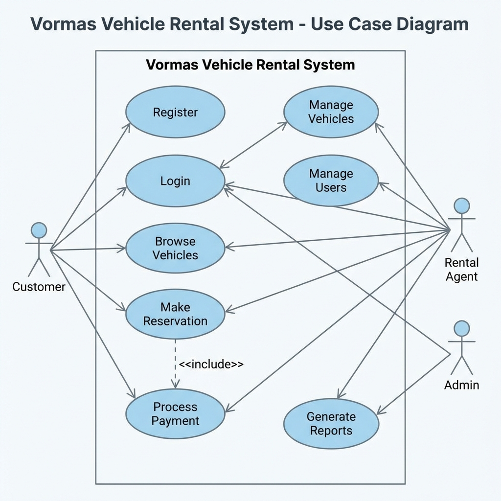
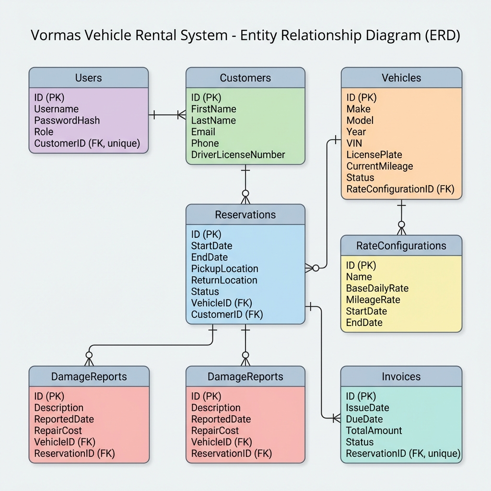

# Project Documentation

## Overview
This document provides a comprehensive overview of the **Vormas** vehicle rental system, including architecture diagrams, use case descriptions, and data model details.

## UML Class Diagram

## UML Use Case Diagram

## Entity‑Relationship Diagram (ERD)

## Architecture Description
- **Layers**: Presentation (WinForms), Domain (models, services), Infrastructure (repositories, DB access).
- **Key Components**: `Vehicle`, `Customer`, `User`, `RateConfigurations`, `DamageReports`, `Reservation`, `Invoice`.
- **Data Flow**: UI → Service → Repository → Database.

## Build & Run Instructions
See the main `README.md` for setup, prerequisites, and execution steps.

---
*Generated on 2026‑01‑12.*
