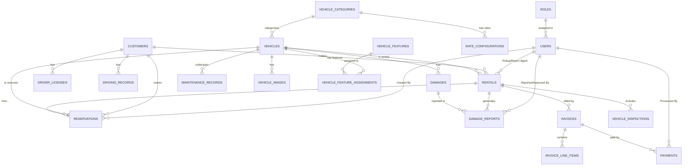
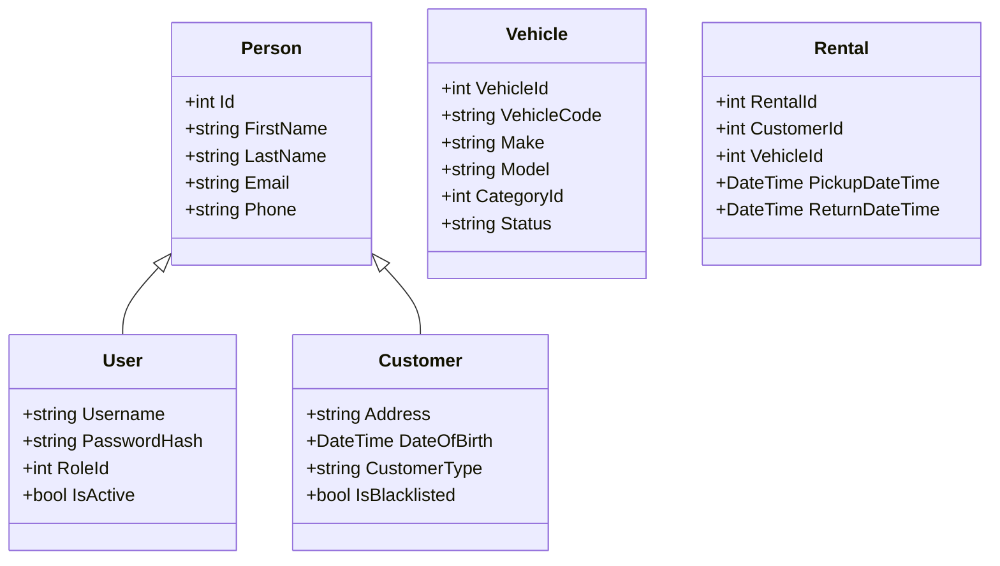
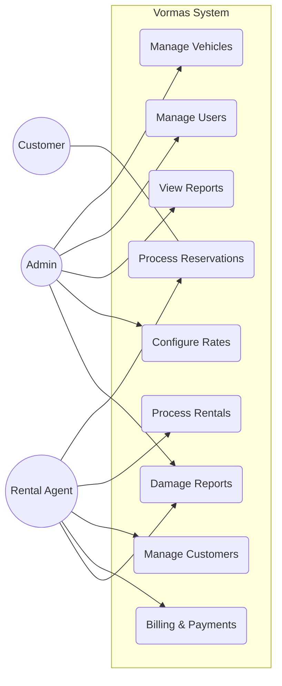

# Project Documentation: Vormas Vehicle Rental Management System

## 1. Executive Summary
Vormas is a comprehensive Vehicle Rental Management System designed to streamline the operations of a vehicle rental business. It provides tools for managing vehicle fleets, customer records, reservations, rentals (pickups and returns), billing, and maintenance. The system supports multiple user roles (Admin and Rental Agent) to ensure secure and efficient task allocation.

## 2. System Architecture
Vormas is built using a hybrid architecture:
- **Desktop Application (WinForms)**: Used for core management tasks like vehicle inventory, user management, and detailed reporting.
- **Web Frontend (Vite/React)**: Provides a modern interface for dashboards and potentially customer-facing features.
- **Database (MariaDB/MySQL)**: Centralized storage for all system data.

## 3. Functional Requirements

### 3.1 Vehicle Management
- Add, update, and remove vehicles.
- Categorize vehicles (Sedan, SUV, etc.).
- Track vehicle status (Available, Rented, Maintenance).
- Manage vehicle features and images.

### 3.2 Customer Management
- Maintain detailed customer profiles.
- Track driving records and license information.
- Blacklist customers based on history.

### 3.3 Reservation and Rental Flow
- Check vehicle availability for specific date ranges.
- Create and manage reservations.
- Process vehicle pickups (start rental) and returns (complete rental).
- Recording odometer readings and fuel levels.

### 3.4 Billing and Payments
- Generate invoices automatically upon rental completion.
- Support for multiple payment methods (Cash, Card, etc.).
- PDF export for invoices.

### 3.5 Damage and Maintenance
- Record vehicle damage during return inspections.
- Create damage reports and assign repair costs.
- Track routine and emergency maintenance records.

## 4. Technical Specifications
- **Language**: C# (.NET Framework) for Desktop, JavaScript/CSS/HTML for Web.
- **Tools**: SQL (Stored Procedures used for complex logic), Git for Version Control.
- **Design Patterns**: Service Layer pattern for business logic, Repository pattern (implied via stored procedures).

## 5. Database Schema (ERD)
The system uses a relational database with 20 tables. Key entities include Users, Customers, Vehicles, Rentals, and Invoices.

## 6. UML Diagrams

### 6.1 Class Diagram
Visualizes the core models and services within the system.

### 6.2 Use Case Diagram
Describes the interactions between users and the system's features.

